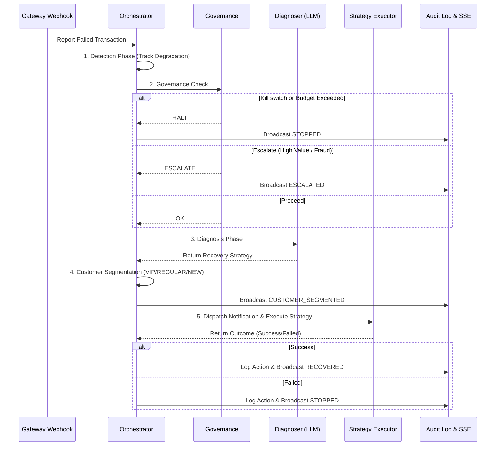

# Agent Pipeline

The X.A.V.I.E.R. Orchestrator operates as a sophisticated state machine. Every failed transaction passes through a strict, linear pipeline defined in `server/app/agent/orchestrator.py`.

## The Transaction Lifecycle

## Pipeline Stages Explained

1. **Detection Phase:** The transaction is analyzed for immediate gateway degradation patterns.
2. **Governance Check:** Before calling expensive LLMs or APIs, X.A.V.I.E.R. checks the `Governance` module to ensure kill switches are off and budgets are intact.
3. **Diagnosis Phase:** The transaction details are fed into the LLM, which determines the root cause.
4. **Customer Segmentation:** The customer's LTV is evaluated to determine if they get white-glove treatment (VIP) or automated nudges.
5. **Strategy Execution:** The selected strategy is executed. This usually involves generating a personalized recovery link and dispatching an email via Resend.
6. **Outcome:** The final state is written to the in-memory store and broadcast to the dashboard.
