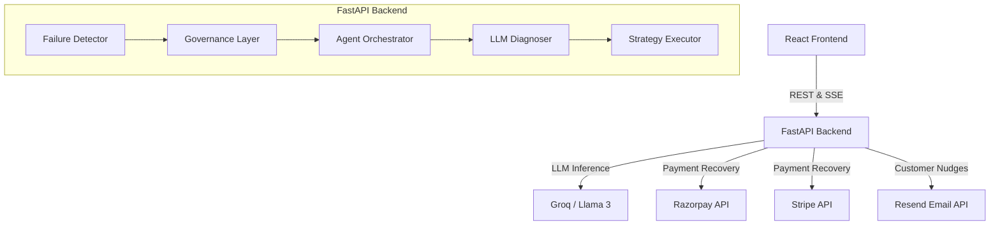

# Architecture Overview

X.A.V.I.E.R. operates as a distributed system comprised of a React frontend and a FastAPI backend orchestrator.

## High-Level System Architecture

## Core Components

### 1. Detector
Monitors incoming transaction failures (via webhooks or direct API calls). It tracks gateway degradation globally and flags anomalies.

### 2. Diagnoser
Utilizes a Large Language Model (Groq/Llama-3) to analyze cryptic bank error codes and context. It determines the true cause of failure and recommends a specific recovery strategy.

### 3. Orchestrator
The central state machine (`app/agent/orchestrator.py`). It receives transactions, passes them through detection and governance, triggers diagnosis, executes the recommended strategy, and manages the SSE event lifecycle.

### 4. Strategy & Action Handlers
Modular functions that execute specific recovery tactics (e.g., `subscription_recovery`, `payment_degradation`, `checkout_dropoff`). They trigger actions like `dispatch_customer_notification`.

### 5. Governance Layer
A safeguard module that enforces kill switches, daily spend limits, and escalation rules to prevent runaway AI behavior or excessive API costs.

### 6. Audit Logger & SSE Layer
Maintains an immutable record of all agent decisions and broadcasts real-time updates (`sse_manager`) to connected frontend clients.
