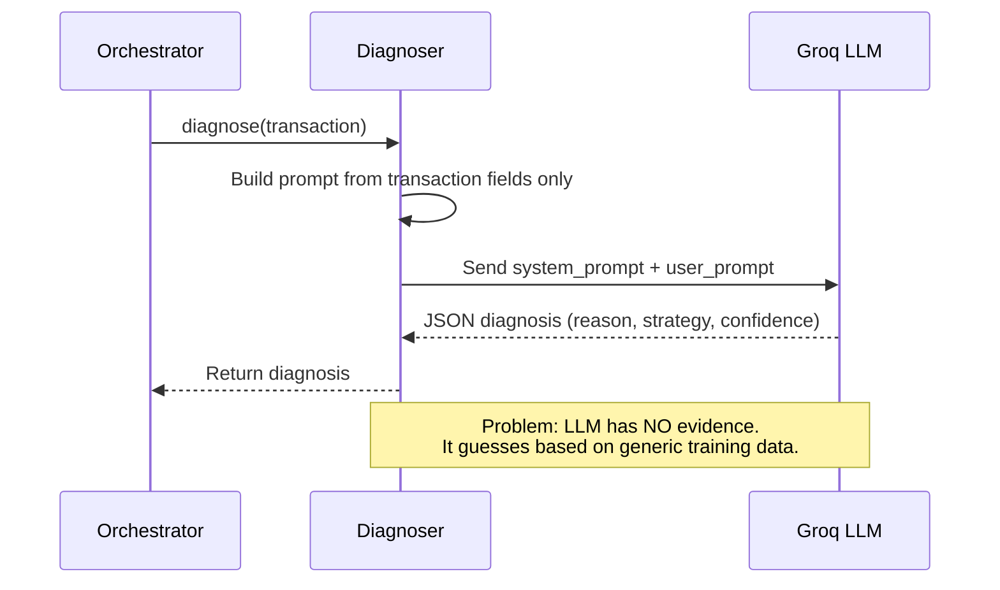
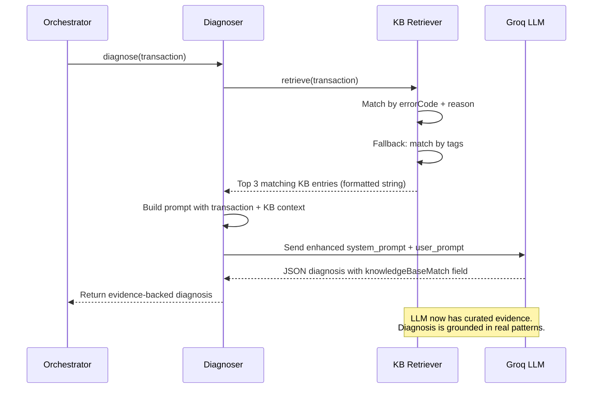
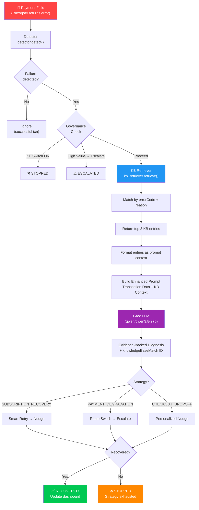

# Knowledge Base Integration — Detailed Implementation Plan

## 1. Goal

Enhance the RevenueGuard AI diagnosis pipeline by adding a **curated Payment Failure Knowledge Base (KB)**. Instead of the LLM reasoning from scratch about why a payment failed, we retrieve the most relevant historical failure patterns from our KB and inject them into the LLM prompt. This is called **Lightweight RAG (Retrieval Augmented Generation)** — retrieval without a vector database.

## 2. Current Architecture (BEFORE)

Currently, when a failed transaction is detected, the system works like this:



The LLM receives ONLY the raw transaction data (amount, error code, bank name) and must figure out the best recovery strategy from scratch. It works, but:
- It can hallucinate strategies that don't apply to Indian payment systems
- It has no knowledge of RBI guidelines on retry limits
- It can't reference historical success rates for specific failure types
- Judges will see it as "just another GPT wrapper"

## 3. Target Architecture (AFTER)



## 4. Directory Structure After Changes

```
server/app/
├── __init__.py
├── ai/
│   ├── __init__.py
│   ├── groq_client.py          ← NO CHANGES
│   ├── prompts.py              ← MODIFY (update prompts)
│   └── kb_retriever.py         ← NEW FILE
├── agent/
│   ├── __init__.py
│   ├── detector.py             ← NO CHANGES
│   ├── diagnoser.py            ← MODIFY (use KB retriever)
│   ├── actions.py              ← NO CHANGES
│   ├── strategies.py           ← NO CHANGES
│   └── orchestrator.py         ← NO CHANGES
├── api/
│   ├── __init__.py
│   ├── routes.py               ← NO CHANGES
│   └── sse_manager.py          ← NO CHANGES
├── audit/
│   ├── __init__.py
│   └── audit_logger.py         ← NO CHANGES
├── data/
│   ├── __init__.py
│   ├── knowledge_base.json     ← NEW FILE (the KB data)
│   ├── synthetic_generator.py  ← NO CHANGES
│   ├── transaction_store.py    ← NO CHANGES
│   ├── audit_store.py          ← NO CHANGES
│   └── seed_data.py            ← NO CHANGES
└── governance/
    ├── __init__.py
    └── rules.py                ← NO CHANGES
```

**Only 3 files are touched: 1 new JSON file, 1 new Python file, 2 modified Python files.**

---

## 5. File-by-File Implementation Details

---

### 5.1 [NEW] `server/app/data/knowledge_base.json`

This is the heart of the feature. A JSON file containing ~45 curated payment failure patterns. It is loaded into memory once at server startup.

#### Schema for each entry:

```json
{
  "id": "string — unique identifier like KB-001",
  "category": "string — one of: CARD_DECLINED, GATEWAY_ERROR, AUTHENTICATION, CHECKOUT_FRICTION, FRAUD_RISK, RECURRING_PAYMENT",
  "errorCode": "string — matches the 'code' field in transaction.errorDetails (e.g., 'card_declined', 'gateway_timeout')",
  "reason": "string — matches the 'reason' field in transaction.errorDetails (e.g., 'INSUFFICIENT_FUNDS')",
  "gateway": "string — 'razorpay', 'stripe', 'all'",
  "description": "string — human-readable explanation of this failure",
  "rootCause": "string — deeper technical explanation of why this happens",
  "bestStrategy": "string — one of: SUBSCRIPTION_RECOVERY, PAYMENT_DEGRADATION, CHECKOUT_DROPOFF",
  "recommendedActions": ["array of strings — ordered list of recovery steps"],
  "retryWindow": "string — 'immediate', '1h', '4h', '24h', or 'none'",
  "historicalSuccessRate": "number — 0 to 100, estimated recovery success %",
  "maxRetries": "number — recommended max retry attempts",
  "rbiGuideline": "string or null — relevant RBI regulation if applicable",
  "tags": ["array of strings — for fallback tag-based matching"]
}
```

#### Complete list of all entries to create:

**Category: CARD_DECLINED (8 entries)**

| ID | reason | retryWindow | successRate | bestStrategy |
|---|---|---|---|---|
| KB-001 | INSUFFICIENT_FUNDS | 24h | 35 | SUBSCRIPTION_RECOVERY |
| KB-002 | RISK_REJECT | none | 10 | SUBSCRIPTION_RECOVERY |
| KB-003 | EXPIRED_CARD | none | 5 | SUBSCRIPTION_RECOVERY |
| KB-004 | STOLEN_CARD | none | 0 | SUBSCRIPTION_RECOVERY |
| KB-005 | CARD_LIMIT_EXCEEDED | 24h | 40 | SUBSCRIPTION_RECOVERY |
| KB-006 | INVALID_CARD_NUMBER | none | 0 | CHECKOUT_DROPOFF |
| KB-007 | DO_NOT_HONOR | 4h | 25 | SUBSCRIPTION_RECOVERY |
| KB-008 | RESTRICTED_CARD | none | 5 | SUBSCRIPTION_RECOVERY |

**Category: GATEWAY_ERROR (8 entries)**

| ID | reason | retryWindow | successRate | bestStrategy |
|---|---|---|---|---|
| KB-009 | ACQUIRER_TIMEOUT | immediate | 75 | PAYMENT_DEGRADATION |
| KB-010 | PROCESSOR_DOWN | immediate | 80 | PAYMENT_DEGRADATION |
| KB-011 | NETWORK_ERROR | immediate | 70 | PAYMENT_DEGRADATION |
| KB-012 | GATEWAY_RATE_LIMITED | 1h | 90 | PAYMENT_DEGRADATION |
| KB-013 | SETTLEMENT_FAILED | 4h | 60 | PAYMENT_DEGRADATION |
| KB-014 | BANK_SERVER_DOWN | immediate | 85 | PAYMENT_DEGRADATION |
| KB-015 | ROUTING_ERROR | immediate | 80 | PAYMENT_DEGRADATION |
| KB-016 | TIMEOUT_BETWEEN_SYSTEMS | immediate | 70 | PAYMENT_DEGRADATION |

**Category: AUTHENTICATION (7 entries)**

| ID | reason | retryWindow | successRate | bestStrategy |
|---|---|---|---|---|
| KB-017 | 3DS_FAILED | immediate | 45 | CHECKOUT_DROPOFF |
| KB-018 | OTP_TIMEOUT | immediate | 55 | CHECKOUT_DROPOFF |
| KB-019 | INVALID_PIN | none | 20 | CHECKOUT_DROPOFF |
| KB-020 | 3DS_NOT_ENROLLED | immediate | 60 | CHECKOUT_DROPOFF |
| KB-021 | BIOMETRIC_FAILED | immediate | 50 | CHECKOUT_DROPOFF |
| KB-022 | OTP_MISMATCH | immediate | 30 | CHECKOUT_DROPOFF |
| KB-023 | CHALLENGE_TIMEOUT | 1h | 50 | CHECKOUT_DROPOFF |

**Category: CHECKOUT_FRICTION (7 entries)**

| ID | reason | retryWindow | successRate | bestStrategy |
|---|---|---|---|---|
| KB-024 | USER_ABANDONED | 1h | 40 | CHECKOUT_DROPOFF |
| KB-025 | PAGE_CRASH | immediate | 65 | CHECKOUT_DROPOFF |
| KB-026 | PAYMENT_METHOD_UNAVAILABLE | immediate | 50 | CHECKOUT_DROPOFF |
| KB-027 | SESSION_EXPIRED | immediate | 55 | CHECKOUT_DROPOFF |
| KB-028 | BROWSER_BACK_BUTTON | 1h | 35 | CHECKOUT_DROPOFF |
| KB-029 | SLOW_LOADING_CHECKOUT | immediate | 60 | CHECKOUT_DROPOFF |
| KB-030 | COUPON_CODE_FAILED | immediate | 70 | CHECKOUT_DROPOFF |

**Category: FRAUD_RISK (7 entries)**

| ID | reason | retryWindow | successRate | bestStrategy |
|---|---|---|---|---|
| KB-031 | VELOCITY_CHECK_FAILED | 4h | 15 | SUBSCRIPTION_RECOVERY |
| KB-032 | ADDRESS_MISMATCH | none | 10 | SUBSCRIPTION_RECOVERY |
| KB-033 | CVV_MISMATCH | none | 5 | CHECKOUT_DROPOFF |
| KB-034 | IP_GEOLOCATION_MISMATCH | none | 10 | SUBSCRIPTION_RECOVERY |
| KB-035 | DEVICE_FINGERPRINT_SUSPICIOUS | none | 5 | SUBSCRIPTION_RECOVERY |
| KB-036 | DUPLICATE_TRANSACTION | none | 0 | CHECKOUT_DROPOFF |
| KB-037 | HIGH_RISK_MERCHANT_CATEGORY | 4h | 20 | SUBSCRIPTION_RECOVERY |

**Category: RECURRING_PAYMENT (8 entries)**

| ID | reason | retryWindow | successRate | bestStrategy |
|---|---|---|---|---|
| KB-038 | MANDATE_REVOKED | none | 5 | SUBSCRIPTION_RECOVERY |
| KB-039 | MANDATE_EXPIRED | none | 10 | SUBSCRIPTION_RECOVERY |
| KB-040 | SUBSCRIPTION_PAUSED_BY_CUSTOMER | none | 15 | SUBSCRIPTION_RECOVERY |
| KB-041 | RECURRING_PAYMENT_LIMIT_EXCEEDED | 24h | 30 | SUBSCRIPTION_RECOVERY |
| KB-042 | AUTO_DEBIT_NOT_REGISTERED | none | 20 | SUBSCRIPTION_RECOVERY |
| KB-043 | E_NACH_DEBIT_FAILED | 24h | 45 | SUBSCRIPTION_RECOVERY |
| KB-044 | UPI_AUTOPAY_DECLINED | 24h | 40 | SUBSCRIPTION_RECOVERY |
| KB-045 | TOKEN_EXPIRED | none | 25 | SUBSCRIPTION_RECOVERY |

For each entry, populate the following fields with realistic content:
- `description`: A 1-2 sentence plain-English explanation (e.g., "The cardholder's bank account does not have enough balance to cover the transaction amount.")
- `rootCause`: A deeper technical explanation (e.g., "The issuing bank's authorization system returned response code 51 (insufficient funds). Common around month-end or before salary credit dates in India.")
- `recommendedActions`: 2-4 ordered recovery steps as an array of strings
- `rbiGuideline`: Relevant RBI regulation text if applicable (e.g., "RBI Circular CO.DPSS.POLC.No.S-516 mandates maximum 3 auto-debit retry attempts within 24 hours"), otherwise `null`
- `tags`: 3-5 lowercase keywords for matching (e.g., `["card", "balance", "insufficient", "decline"]`)

---

### 5.2 [NEW] `server/app/ai/kb_retriever.py`

This module loads the knowledge base into memory and provides a retrieval function.

#### Complete Logic:

```python
import json
import os

class KBRetriever:
    def __init__(self):
        self.entries = []
        self._load()
    
    def _load(self):
        """Load knowledge_base.json from the data directory into memory."""
        # Build the path relative to THIS file's location
        # This file is at: server/app/ai/kb_retriever.py
        # KB file is at:   server/app/data/knowledge_base.json
        kb_path = os.path.join(
            os.path.dirname(__file__),  # server/app/ai/
            '..', 'data', 'knowledge_base.json'  # server/app/data/knowledge_base.json
        )
        kb_path = os.path.abspath(kb_path)
        
        with open(kb_path, 'r') as f:
            data = json.load(f)
            self.entries = data.get('patterns', [])
        
        print(f"[KB] Loaded {len(self.entries)} knowledge base entries")
    
    def retrieve(self, transaction, top_k=3):
        """
        Retrieve the most relevant KB entries for a given transaction.
        
        Matching priority:
        1. EXACT MATCH on both errorCode AND reason (highest relevance)
        2. PARTIAL MATCH on just reason (medium relevance)
        3. PARTIAL MATCH on just errorCode (medium relevance)  
        4. TAG MATCH — check if any of the transaction's keywords appear 
           in the entry's tags (lowest relevance)
        
        Returns: list of up to top_k entries, sorted by relevance score descending.
        """
        error_details = transaction.get('errorDetails', {})
        txn_error_code = error_details.get('code', '')        # e.g., "card_declined"
        txn_reason = error_details.get('reason', '')          # e.g., "INSUFFICIENT_FUNDS"
        txn_message = error_details.get('message', '').lower()  # for tag matching
        
        scored = []
        
        for entry in self.entries:
            score = 0
            
            # Priority 1: Exact match on both errorCode AND reason
            if entry.get('errorCode') == txn_error_code and entry.get('reason') == txn_reason:
                score = 100
            # Priority 2: Match on reason only
            elif entry.get('reason') == txn_reason:
                score = 75
            # Priority 3: Match on errorCode only
            elif entry.get('errorCode') == txn_error_code:
                score = 50
            # Priority 4: Tag-based matching
            else:
                entry_tags = entry.get('tags', [])
                # Build search terms from the transaction
                search_terms = txn_reason.lower().replace('_', ' ').split()
                search_terms += txn_message.split()
                
                matching_tags = sum(1 for tag in entry_tags if tag in search_terms)
                if matching_tags > 0:
                    score = 10 * matching_tags  # More matching tags = higher score
            
            if score > 0:
                scored.append((score, entry))
        
        # Sort by score descending, take top_k
        scored.sort(key=lambda x: x[0], reverse=True)
        results = [entry for _, entry in scored[:top_k]]
        
        return results
    
    def format_for_prompt(self, entries):
        """
        Convert a list of KB entries into a formatted string 
        suitable for injection into the LLM prompt.
        
        Example output:
        
        ### KB-001 | INSUFFICIENT_FUNDS (Card Declined)
        - Description: Cardholder's account has insufficient balance
        - Root Cause: Issuing bank returned code 51...
        - Best Strategy: SUBSCRIPTION_RECOVERY
        - Recommended Actions: 1) Wait 24h... 2) Send nudge...
        - Historical Success Rate: 35%
        - Retry Window: 24h
        - RBI Guideline: RBI mandates max 3 retries...
        """
        if not entries:
            return "No matching patterns found in knowledge base."
        
        formatted_parts = []
        
        for entry in entries:
            actions = "\n    ".join(
                f"{i+1}. {a}" for i, a in enumerate(entry.get('recommendedActions', []))
            )
            
            rbi = entry.get('rbiGuideline') or 'None applicable'
            
            part = f"""### {entry['id']} | {entry.get('reason', 'UNKNOWN')} ({entry.get('category', '')})
- Description: {entry.get('description', 'N/A')}
- Root Cause: {entry.get('rootCause', 'N/A')}
- Best Strategy: {entry.get('bestStrategy', 'N/A')}
- Recommended Actions:
    {actions}
- Historical Success Rate: {entry.get('historicalSuccessRate', 'N/A')}%
- Optimal Retry Window: {entry.get('retryWindow', 'N/A')}
- Max Retries: {entry.get('maxRetries', 'N/A')}
- RBI Guideline: {rbi}"""
            
            formatted_parts.append(part)
        
        return "\n\n".join(formatted_parts)


# Singleton instance — loaded once at import time
kb_retriever = KBRetriever()
```

#### Key design decisions:
- **No vector database** — We use simple keyword/exact matching because we have only 45 entries. A vector DB (ChromaDB, Pinecone) would be overkill and add deployment complexity.
- **Singleton** — The KB is loaded once when the module is imported. It stays in memory for the lifetime of the server.
- **Scoring system** — Exact match on both fields gets 100 points, partial matches get 50-75, tag-based gets 10-30. This ensures the most relevant entry always surfaces first.

---

### 5.3 [MODIFY] `server/app/ai/prompts.py`

Current file location: `server/app/ai/prompts.py` (53 lines)

#### Change 1: Update `DIAGNOSTIC_SYSTEM_PROMPT`

**REPLACE the entire `DIAGNOSTIC_SYSTEM_PROMPT` string (lines 1-18) with:**

```python
DIAGNOSTIC_SYSTEM_PROMPT = """You are the RevenueGuard AI agent, an expert payment failure diagnostician for the Indian digital payments ecosystem.

You have access to a curated Knowledge Base (KB) of documented payment failure patterns with historical recovery data. Use the provided KB evidence to ground your diagnosis. Do NOT ignore the KB entries — they contain real-world success rates and RBI compliance guidelines.

Your task:
1. Read the transaction data carefully
2. Study the matching Knowledge Base entries provided
3. Combine the KB evidence with your own reasoning to produce a diagnosis
4. If the KB recommends a strategy, prefer it unless you have strong reason to deviate

You MUST respond in valid JSON format matching this exact schema:
{
  "reason": "Clear, specific explanation of why this payment failed",
  "confidence": 0-100 (integer, higher if KB match is strong),
  "strategy": "One of: SUBSCRIPTION_RECOVERY, PAYMENT_DEGRADATION, CHECKOUT_DROPOFF",
  "riskFactors": ["list", "of", "contributing", "factors"],
  "recommendedAction": "Specific, actionable next step to recover this payment",
  "optimalRetryWindow": "immediate, 1h, 4h, 24h, or none",
  "knowledgeBaseMatch": "The KB entry ID that most closely matches (e.g., KB-001), or null if no match"
}

Strategy Selection Guidelines (from KB patterns):
- INSUFFICIENT_FUNDS, RISK_REJECT, EXPIRED_CARD, mandate/subscription failures → SUBSCRIPTION_RECOVERY
- GATEWAY_TIMEOUT, PROCESSOR_DOWN, NETWORK_ERROR, routing/settlement failures → PAYMENT_DEGRADATION
- USER_ABANDONED, 3DS_FAILED, OTP_TIMEOUT, PAGE_CRASH, session/checkout friction → CHECKOUT_DROPOFF
"""
```

#### Change 2: Update `generate_diagnostic_prompt` function

**REPLACE the entire `generate_diagnostic_prompt` function (lines 20-33) with:**

```python
def generate_diagnostic_prompt(transaction, kb_context=""):
    """
    Build the user prompt for diagnosis.
    Now accepts an optional kb_context string containing formatted KB entries.
    """
    base = f"""## Transaction Data
- Transaction ID: {transaction['id']}
- Amount: ₹{transaction['amount']} {transaction.get('currency', 'INR')}
- Gateway: {transaction.get('gateway', 'Unknown')}
- Bank: {transaction.get('bankName', 'Unknown')}
- Payment Method: {transaction.get('paymentMethod', 'Unknown')}
- Customer Is Repeat: {transaction.get('customerInfo', {}).get('isRepeat', False)}
- Previous Failed Attempts: {transaction.get('customerInfo', {}).get('previousAttempts', 0)}
- Device: {transaction.get('metadata', {}).get('device', 'Unknown')}

## Error Details
- Error Code: {transaction.get('errorDetails', {}).get('code', 'N/A')}
- Error Reason: {transaction.get('errorDetails', {}).get('reason', 'N/A')}
- Error Message: {transaction.get('errorDetails', {}).get('message', 'N/A')}"""

    if kb_context:
        base += f"""

## Relevant Knowledge Base Entries
The following are the most relevant historical failure patterns from our curated database. Use these as evidence to inform your diagnosis:

{kb_context}"""

    base += """

## Task
Analyze this payment failure using both the transaction data and the knowledge base evidence above. Return your JSON diagnosis."""

    return base
```

The `NUDGE_SYSTEM_PROMPT` and `generate_nudge_prompt` functions at the bottom of the file (lines 35-53) remain **UNCHANGED**.

---

### 5.4 [MODIFY] `server/app/agent/diagnoser.py`

Current file location: `server/app/agent/diagnoser.py` (89 lines)

#### Change 1: Add import for kb_retriever (line 2)

**After line 2** (`from ..ai.prompts import ...`), **add a new import line:**

```python
from ..ai.kb_retriever import kb_retriever
```

#### Change 2: Update the `diagnose` method to use KB retrieval

**REPLACE the `diagnose` method (lines 44-56) with:**

```python
    async def diagnose(self, transaction):
        try:
            # Step 1: Retrieve relevant KB entries
            kb_entries = kb_retriever.retrieve(transaction, top_k=3)
            kb_context = kb_retriever.format_for_prompt(kb_entries)
            
            # Log what we matched for debugging
            matched_ids = [e['id'] for e in kb_entries]
            print(f"[Diagnoser] KB matches for {transaction['id']}: {matched_ids}")
            
            # Step 2: Build the enhanced prompt with KB context
            prompt = generate_diagnostic_prompt(transaction, kb_context=kb_context)
            
            # Step 3: Send to Groq LLM
            diagnosis = await groq_client.analyze(DIAGNOSTIC_SYSTEM_PROMPT, prompt)
            diagnosis['isAI'] = True
            
            # Step 4: Attach KB metadata to the diagnosis for the frontend
            if kb_entries:
                diagnosis['knowledgeBaseMatch'] = kb_entries[0].get('id')
                diagnosis['kbSuccessRate'] = kb_entries[0].get('historicalSuccessRate')
            
            sse_manager.broadcast({
                'type': 'DIAGNOSIS_COMPLETE',
                'transactionId': transaction['id'],
                'diagnosis': diagnosis
            })
            return diagnosis
            
        except Exception as e:
            print(f"[Diagnoser] AI diagnosis failed for {transaction['id']}, falling back to heuristics: {str(e)}")
            return self._heuristic_fallback(transaction)
```

The `_heuristic_fallback` method (lines 63-86) and the `HEURISTIC_MAP` dict (lines 5-41) remain **UNCHANGED**.

---

## 6. Data Flow Diagram (Complete)

This diagram shows the complete flow after implementation, from a payment failing to the dashboard showing an evidence-backed diagnosis:



---

## 7. What the LLM Prompt Looks Like (Before vs After)

### BEFORE (current — no KB):

```
SYSTEM: You are the RevenueGuard AI agent...

USER: 
Transaction ID: txn_abc123
Amount: 5000 INR
Gateway: Razorpay
Bank: HDFC Bank
Error Code: card_declined
Error Reason: INSUFFICIENT_FUNDS

Analyze this failure and return the JSON diagnosis.
```

### AFTER (with KB context):

```
SYSTEM: You are the RevenueGuard AI agent... You have access to a curated 
Knowledge Base (KB) of documented payment failure patterns...

USER: 
## Transaction Data
- Transaction ID: txn_abc123
- Amount: ₹5000 INR
- Gateway: Razorpay
- Bank: HDFC Bank
- Customer Is Repeat: True
- Previous Failed Attempts: 2

## Error Details
- Error Code: card_declined
- Error Reason: INSUFFICIENT_FUNDS

## Relevant Knowledge Base Entries

### KB-001 | INSUFFICIENT_FUNDS (CARD_DECLINED)
- Description: Cardholder's account does not have sufficient balance
- Root Cause: Issuing bank returned response code 51. Common around 
  month-end before salary credit dates in India.
- Best Strategy: SUBSCRIPTION_RECOVERY
- Recommended Actions:
    1. Wait 24 hours for potential salary/credit cycle
    2. Send gentle nudge suggesting alternate payment method
    3. If recurring subscription, initiate dunning sequence
- Historical Success Rate: 35%
- Optimal Retry Window: 24h
- Max Retries: 3
- RBI Guideline: RBI mandates max 3 auto-debit retry attempts within 24h

### KB-005 | CARD_LIMIT_EXCEEDED (CARD_DECLINED)
- Description: Transaction exceeds the card's daily/monthly limit...
...

## Task
Analyze this payment failure using both the transaction data and the 
knowledge base evidence above. Return your JSON diagnosis.
```

---

## 8. Verification Plan

### Step 1: Server Startup Check
Start the server. You should see this log line:
```
[KB] Loaded 45 knowledge base entries
```

### Step 2: Run a Batch
Go to the Agent Console in the UI and click "Run Batch". Watch the server terminal. For each transaction, you should now see:
```
[Diagnoser] KB matches for txn_abc123: ['KB-001', 'KB-005', 'KB-007']
```

### Step 3: Check LLM Response
The diagnosis JSON from Groq should now contain:
```json
{
  "reason": "...",
  "confidence": 92,
  "strategy": "SUBSCRIPTION_RECOVERY",
  "knowledgeBaseMatch": "KB-001",
  ...
}
```

The confidence should be higher than before because the LLM has evidence backing its decision.

---

## 9. Summary of Changes

| File | Action | Lines Changed |
|---|---|---|
| `server/app/data/knowledge_base.json` | **NEW** | ~500 lines (45 entries) |
| `server/app/ai/kb_retriever.py` | **NEW** | ~100 lines |
| `server/app/ai/prompts.py` | **MODIFY** | Replace lines 1-33 |
| `server/app/agent/diagnoser.py` | **MODIFY** | Add 1 import + replace lines 44-56 |

**No other files need to change.** The orchestrator, routes, strategies, actions, governance, SSE manager, and frontend all remain untouched.
